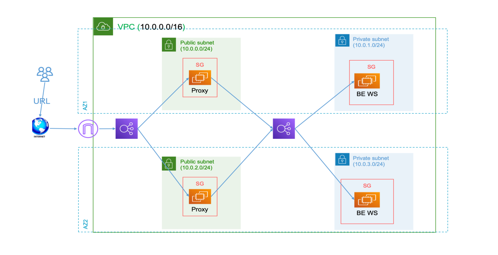
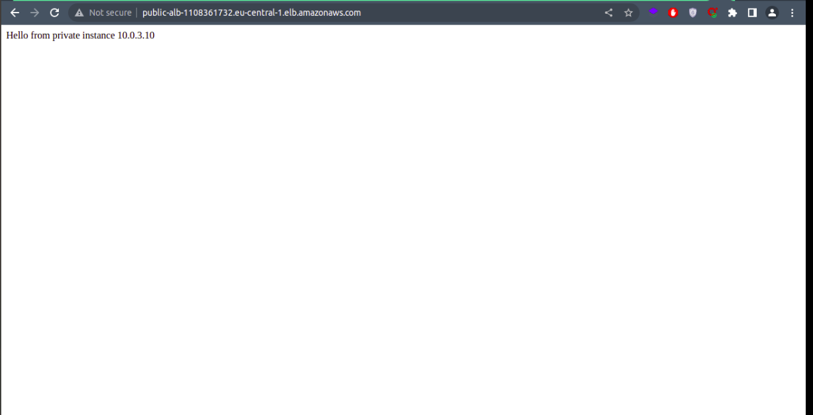

# AWS Terraform project

created by [Aly Ghazal](https://github.com/Aly-Ghazal)

Assigned by Eng.[Sabreen Salama](https://github.com/sabreensalama) "special Thanks for her guidance and support" 💙🤩

This project is my first infrastructure as a code (iaac) project

## Requriments

- Don’t work on the default Workspace Create a new workspace called dev
  
    ```
    $ terraform workspace create dev
    ```

- Using custom not public modules to implement the below diagram remote bucket For statefile

- Use remote provisioner to install apache or proxy in machines then use local-exec to
    print all the ips to a file called all-ips.txt with format
  - public-ip1 1.1.1.1
  - public-ip2 2.2.2.2

- The first Loadbalancer is public , and the other one that will send thee traffic to the private machines will be private
- Screenshot from the configuration of the proxy
- Screenshot from the public dns of the load balancer when you send a traffic to it from a browser and it returns the content of the private ec2s
- Screenshot from the s3 that contain the state file



## Output

the output of this project is to use the public Load balancer's DNS name to access the private instances (web server) and here is the result

